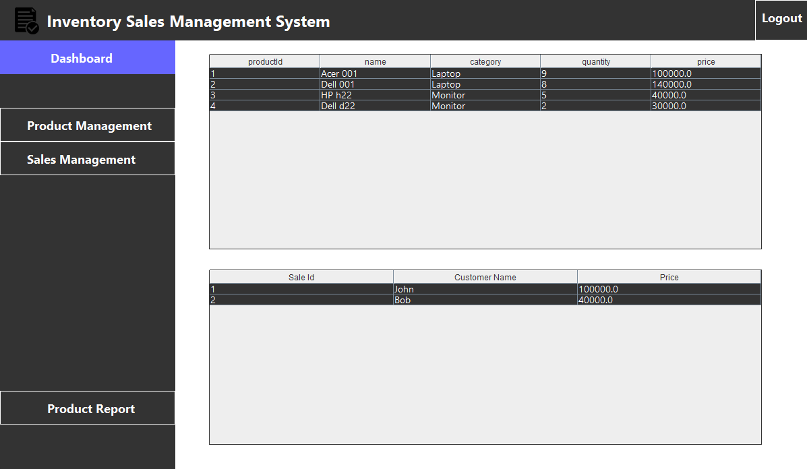

# Inventory & Sales Management System

A Java-based desktop application designed to manage product inventory, record sales, and generate dynamic PDF reports. This project was developed as part of an Diploma Software Engineering module.

## 🚀 Features
- **Product Management:** Add, update, and delete inventory items.
- **Sales Recording:** Real-time stock reduction when sales are made.
- **Reporting:** Generates PDF product reports using **JasperReports**.
- **Database:** Persistent data storage using MySQL.

## 🛠️ Tech Stack
- **Language:** Java (JDK 17+)
- **IDE:** NetBeans
- **Database:** MySQL
- **Reporting:** JasperReports 6.20.0
- **Build Tool:** Ant (NetBeans Default)

## ⚙️ Setup & Installation

### 1. Clone the Repository

- git clone [https://github.com/YOUR_USERNAME/Inventory-Sales-Management-System.git](https://github.com/YOUR_USERNAME/Inventory-Sales-Management-System.git)

### 2. Database Setup

- Open MySQL Workbench or phpMyAdmin.
- Create a new database named inventory.
- Import the inventory.sql file included in this repository (or manually create products and sales tables).
- Update Credentials: Open src/Jframe/DBConnection.java and update the username/password if yours is different from root/root.

### 3. Library Configuration (Important!)

- Since this project uses local JAR files, you must link them manually in NetBeans:
- Open the project in NetBeans.
- If you see red exclamation marks (!) on the project, right-click the project name and select Properties.
- Go to Libraries.
- Remove any "Missing" libraries if listed.
- Click Add JAR/Folder.
- Navigate to the jarFiles folder inside this project directory.
- Select and add ALL the .jar files found there (MySQL Connector, JasperReports, Commons, etc.).
- Click OK.

### 4. Run the Application

- Right-click the project and select Clean and Build.
- Run the project.

## 📄 License

This project is licensed under the MIT License - see the LICENSE file for details.

## 👤 Author

- Mihiranga
- GitHub: @mihiranga-dev
